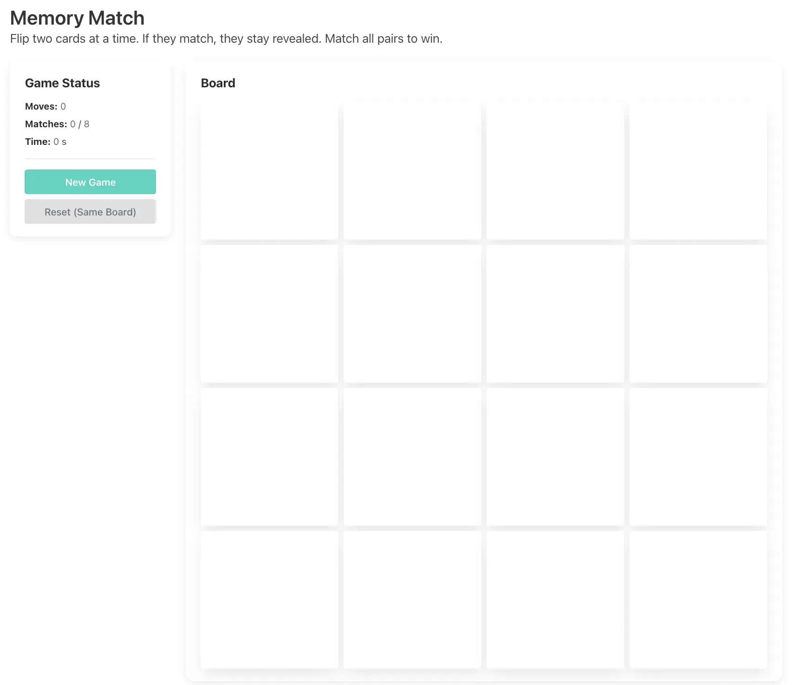
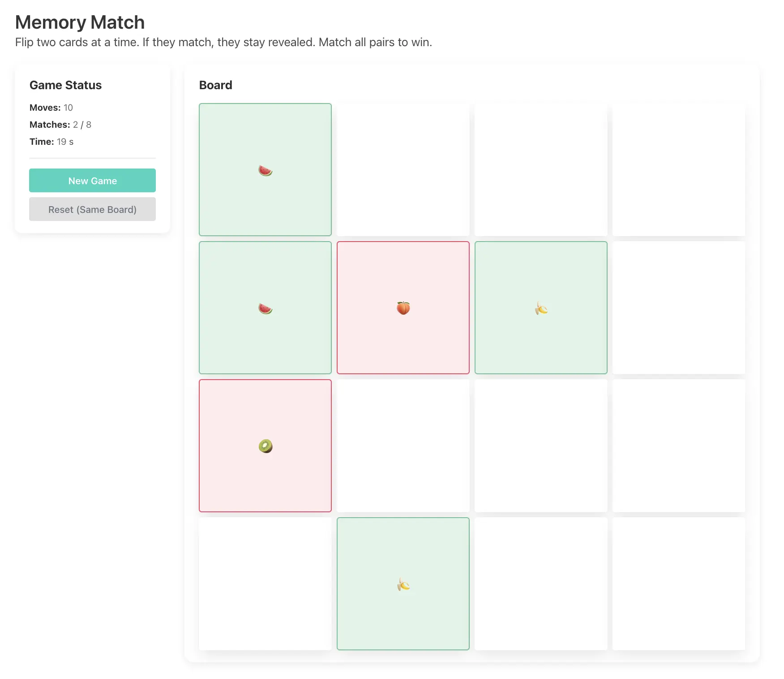
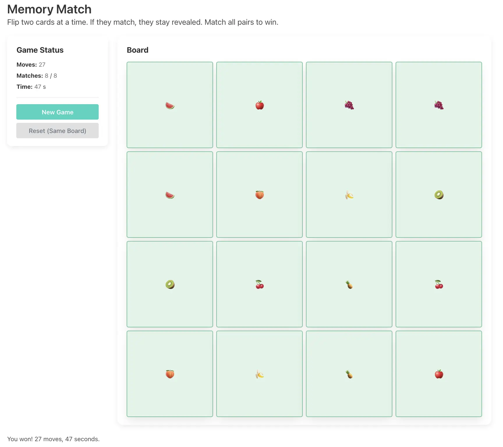
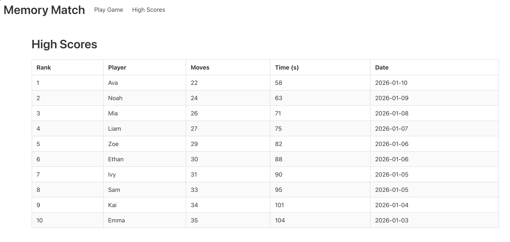

# Memory Match

A browser-based memory card matching game built with HTML, CSS, vanilla JavaScript, and Bulma.

## Overview

Memory Match is a 4 x 4 card game where the player flips two cards at a time to find matching pairs. The game tracks moves, matched pairs, and elapsed time. When all eight pairs are matched, the game shows a win message with the final move count and time.

## Features

- Randomized 16-card board with 8 matching pairs.
- Fisher-Yates shuffle for each new game.
- Move counter, match counter, and elapsed-time timer.
- New Game button for a newly shuffled board.
- Reset button to replay the same board layout.
- High Scores page with a sample score table.
- Responsive layout using Bulma and custom CSS.

## Project Structure

```text
.
├── README.md
├── images
│   ├── img1.webp
│   ├── img2.webp
│   ├── img3.webp
│   └── img4.webp
└── src
    ├── css
    │   └── memory_match.css
    ├── js
    │   ├── high_scores.js
    │   └── memory_match.js
    └── pages
        ├── high_scores.html
        └── memory_match.html
```

## How to Run

From the project root, serve the `src` folder with a local web server:

```bash
cd src
python3 -m http.server 8000
```

Then open:

```text
http://localhost:8000/pages/memory_match.html
```

You can also open `src/pages/memory_match.html` directly in a browser, but using a local server is recommended.

## Pages

- Game page: `src/pages/memory_match.html`
- High scores page: `src/pages/high_scores.html`

## Images






## How to Play

1. Click a card to reveal it.
2. Click a second card to check for a match.
3. Matching cards stay revealed.
4. Non-matching cards flip back after a short delay.
5. Match all eight pairs to win.

## Notes

The high scores page currently uses static sample data from `src/js/high_scores.js`. Scores are not saved automatically after a game.
